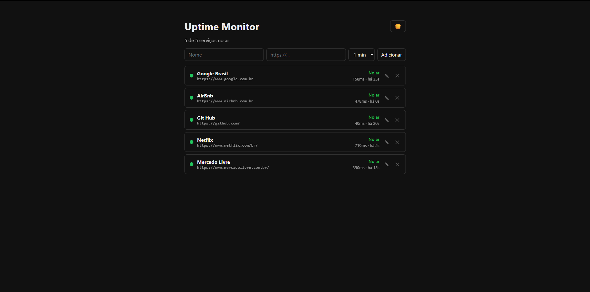
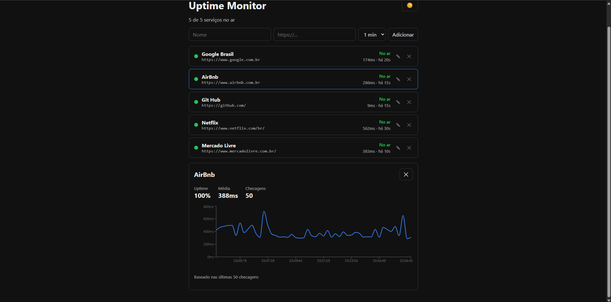
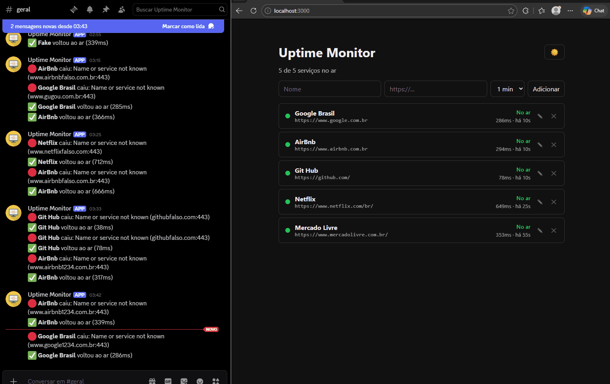
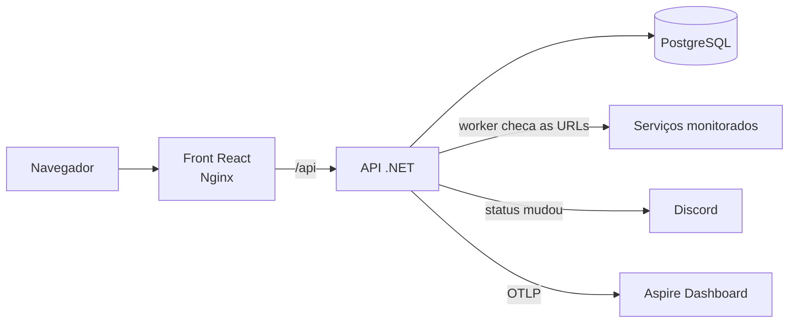

# Uptime Monitor


Monitor de uptime self-hosted: você cadastra as URLs, ele checa cada uma de tempos em tempos, guarda o histórico e avisa no Discord quando algum serviço cai ou volta.



## De onde veio a ideia

No meu estágio eu trabalho com sistemas que rodam como serviços em segundo plano, e uma das coisas que mais dá dor de cabeça é descobrir tarde que um deles parou. Cheguei a criar no trabalho a regra que identifica serviço parado num desses sistemas e a desenhar um monitor com alertas.

Quis levar essa ideia adiante num projeto meu, do zero e genérico: qualquer URL, qualquer serviço, com front, API, testes e tudo rodando com um comando.

## O que ele faz

- Cadastro, edição e exclusão de serviços pela tela, cada um com seu intervalo de checagem
- Um worker em segundo plano que checa cada serviço no intervalo configurado e grava o resultado (status, tempo de resposta e erro, se tiver)
- Alerta no Discord só quando o status **muda** (caiu ou voltou), sem spam a cada checagem
- Painel que se atualiza sozinho, com resumo, status, tempo de resposta e "há quanto tempo" foi a última checagem
- Detalhe de cada serviço com uptime, tempo médio e gráfico de tempo de resposta
- Tema claro e escuro
- Telemetria com OpenTelemetry: logs, traces e métricas próprias das checagens





## Stack

**Back-end:** .NET 10, ASP.NET Core, Entity Framework Core, PostgreSQL
**Front-end:** React, TypeScript, Vite, Recharts
**Infra:** Docker Compose, Nginx, GitHub Actions
**Observabilidade:** OpenTelemetry, Aspire Dashboard
**Testes:** xUnit

## Como funciona



A API e o worker rodam no mesmo processo. O worker acorda a cada 5 segundos, vê quais serviços já passaram do intervalo e checa só esses. O front não fala direto com a API: o Nginx serve os arquivos do React e repassa tudo que é `/api` pra ela.

## Rodando

Precisa só do Docker.

```bash
git clone https://github.com/guilhermecorreiafh/uptime-monitor.git
cd uptime-monitor
cp .env.example .env
docker compose up -d --build
```

O `.env` é opcional: se quiser receber os alertas, coloque nele a URL de um webhook do Discord. Sem ela, o monitor funciona normal e só registra no log que o alerta foi ignorado.

Depois de subir:

| O quê | Onde |
|---|---|
| Painel | http://localhost:3000 |
| API | http://localhost:8080 |
| Health check | http://localhost:8080/health |
| Telemetria | http://localhost:18888 |

As migrations do banco são aplicadas automaticamente quando a API sobe.

### Desenvolvendo

Pra mexer no código com recarregamento automático, suba só o banco e o dashboard pelo Docker e rode a API e o front na máquina:

```bash
docker compose up -d db dashboard
dotnet run --project api
```

E em outro terminal:

```bash
cd web
npm install
npm run dev
```

O front fica em http://localhost:5173 e a documentação interativa da API (Scalar) em http://localhost:5267/scalar.

Pra receber alertas em desenvolvimento, a URL do webhook fica no User Secrets, fora do repositório:

```bash
dotnet user-secrets set "Alerts:DiscordWebhookUrl" "SUA_URL" --project api
```

## API

| Método | Rota | Descrição |
|---|---|---|
| GET | `/api/monitored-services` | Lista os serviços com o status atual |
| GET | `/api/monitored-services/{id}` | Detalhe de um serviço |
| POST | `/api/monitored-services` | Cadastra um serviço |
| PUT | `/api/monitored-services/{id}` | Edita um serviço |
| DELETE | `/api/monitored-services/{id}` | Exclui um serviço e o histórico dele |
| GET | `/api/monitored-services/{id}/results?limit=50` | Histórico de checagens (máximo 500) |
| GET | `/health` | Saúde da API e da conexão com o banco |

## Algumas decisões

Coisas que eu pensei no caminho e que valem registrar:

- **Alerta só na mudança de status.** A regra é uma função pura (`StatusTransition`), separada de propósito pra ser fácil de testar. Na primeira checagem de um serviço ela não alerta, pra não disparar uma enxurrada de mensagens toda vez que a API sobe.
- **O intervalo não é exato.** Como o worker olha a lista a cada 5 segundos, um serviço configurado pra 10s pode ser checado com até 15s. Pra um monitor, essa margem é aceitável e mantém o worker simples.
- **Datas em UTC.** O banco guarda tudo em UTC e o navegador converte pro fuso de quem está vendo.
- **Falha não entra na média.** No gráfico, uma checagem que falhou vira um buraco na linha em vez de um ponto. Um erro de DNS responde em 3ms, e contar isso como tempo de resposta faria o serviço parecer mais rápido justamente quando está fora.
- **Nenhum segredo no repositório.** A URL do webhook fica no User Secrets em desenvolvimento e no `.env` (ignorado pelo Git) no Docker.

## Testes

```bash
dotnet test
```

Rodam também a cada push pelo GitHub Actions.

## Próximos passos

- Deploy numa VM, com o painel público em modo somente leitura
- Proteger o cadastro e a exclusão de serviços